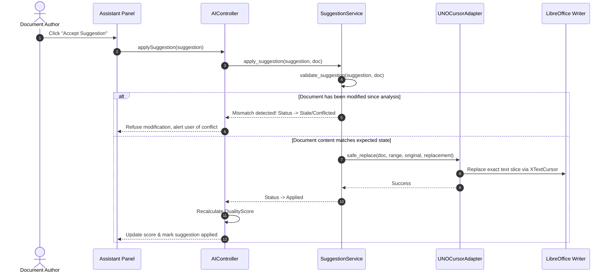

# Architecture Specification: AI-Enhanced LibreOffice Writer

## 1. Overview & Golden Principle

The **AI-Enhanced LibreOffice Writer** system is an intelligent, non-destructive document assistance platform. It operates strictly under the principle:

> **AI ASSISTS. USER DECIDES.**
> The system analyzes, detects problems, calculates metrics, and recommends improvements. It **NEVER** silently overwrites, deletes, formats, or uploads document content without explicit user approval.

---

## 2. Explicit Architecture Decisions (Per Section 51)

1. **Programming Language**: Python 3.10+ utilizing native PyUNO (`uno`) bindings bundled with LibreOffice 7.0+.
2. **LibreOffice Integration**: Primary native PyUNO Addon (`Addons.xcu`, `com.sun.star.task.Job`) with a dedicated integration adapter layer (`src/integration/`).
3. **AI vs Rule-Based Strategy**:
   - *Deterministic Rule Engines*: Privacy / PII detection, semantic formatting analysis, date/number consistency, heading hierarchy.
   - *AI/NLP Provider*: Grammar, spelling, and style suggestion generation via pluggable `AIModelProvider` (`LocalRuleBasedProvider`, `MockProvider`, and `ExternalAPIProvider`).
4. **Scoring Algorithm**: Deterministic multi-dimensional penalty model inside `QualityService` with explicit weights:
   - **Writing**: 25%
   - **Consistency**: 20%
   - **Formatting**: 20%
   - **Readability**: 20%
   - **Privacy**: 15%
5. **Persistence**: In-memory session model per active document with exportable JSON/Markdown/HTML reports and optional SQLite persistence (`src/repositories/`).
6. **Performance Target**: Analysis execution under 5 seconds for documents up to 10 pages (~6,500 words).

---

## 3. Five-Layer System Architecture

```
Layer 1: LibreOffice Integration (src/integration/)
├── libreoffice_connection.py   (Socket/Pipe desktop connection)
├── uno_document_adapter.py     (UNO TextDocument / ODT Zip -> Domain Document)
├── uno_cursor_adapter.py       (Safe range highlighting & atomic text replacement)
└── sidebar_controller.py       (Event dispatcher between UI & Controller)

Layer 2: Application Controller & Services (src/controller/ & src/services/)
├── ai_controller.py            (Analysis coordinator, suggestion dispatcher)
├── quality_service.py          (Deterministic multi-factor score calculation)
├── suggestion_service.py       (Safe non-destructive modification & conflict checks)
└── report_service.py           (Report generation and Markdown/HTML/TXT export)

Layer 3: Document Parser & Domain Models (src/parser/ & src/models/)
├── document_parser.py          (Text, structural, and formatting extractors)
├── document.py                 (Document, Paragraph, Heading, Formatting)
├── document_range.py           (Precise paragraph & character offset targeting)
├── document_revision.py        (Snapshot hashing & drift detection)
├── suggestion.py               (Suggestion, SuggestionType, SuggestionStatus, Severity)
├── quality_score.py            (Overall and dimensional scores)
└── report.py                   (Quality report domain model)

Layer 4: Analysis Modules (src/analysis/)
├── analysis_module.py          (Base class with fault-tolerant execution contract)
├── writing_assistant.py        (Grammar, spelling, and style analysis)
├── consistency_analyzer.py     (Advisory names, terminology, dates, numbers)
├── formatting_engine.py        (Semantic role-based font, heading, layout checks)
├── readability_module.py       (Flesch Reading Ease, sentence & vocabulary complexity)
└── sensitive_info_detector.py  (Emails, phone numbers, personal identifiers)

Layer 5: AI Provider Abstraction (src/ai/)
├── ai_model.py                 (AIModel abstract base class)
├── ai_provider.py              (AIProvider interface)
├── local_provider.py           (Offline rule-based NLP & heuristic provider)
├── mock_provider.py            (Deterministic mock provider for testing)
└── external_provider.py        (Pluggable REST/HTTPS LLM provider)
```

---

## 4. Safe Non-Destructive Modification Protocol



---

## 5. Fault Tolerance & Module Isolation

When a single analysis module encounters an unexpected exception or timeout:
1. The error is intercepted and recorded in `AnalysisResult.moduleErrors[moduleName]`.
2. Execution immediately proceeds to the remaining analysis modules.
3. Quality scores are calculated on available module outputs.
4. The user is informed via the summary report without crashing the session.

